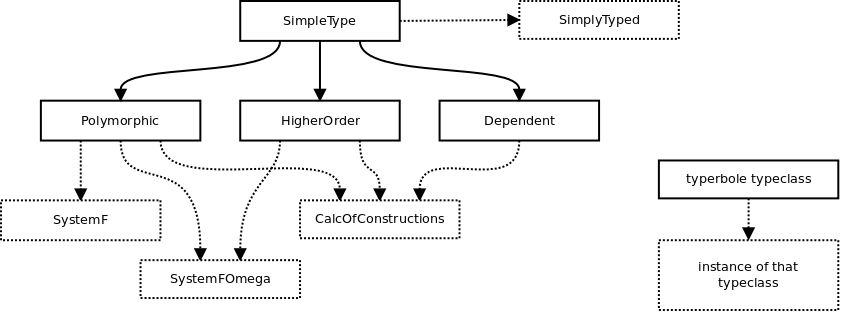

# typerbole

A library classifying typesystems with typeclasses.

## Parameterized Typesystems

Like how datatypes such as `List a` (`[a]`), `Set a`, `Tree a` etc. in haskell have a parameter for a contained type, this library is based on the idea that a datatype that represents expressions can have a parameter for a typesystem.

### The Lambda Calculus

As an example, we can put together a datatype that represents the syntax for the Lambda Calculus:

```haskell
data LambdaTerm c v t =
      Variable v -- a variable bound by a lambda abstraction
    | Constant c -- a constant defined outside of the term
    | Apply (LambdaTerm c v t) (LambdaTerm c v t) -- an application of one term to another
    | Lambda (v, t) (LambdaTerm c v t) -- A lambda abstraction
```

This datatype has 3 parameters. The first two parameters represent constants and variables respectively, what's important is the final parameter `t` which is the parameter for the typesystem being used.

## The Lambda Cube

The lambda cube describes the properties of a number of typesystems, an overview can be found [**here**](./lambdacube-overview.md). It is the basis for the library's classification of typesystems, a typeclass hierarchy where each axis is represented by a typeclass whose methods and associated types are indicitive of the properties of the axis.



***

### Supported lambda-cube axies

- [x] Simply-typed lambda calculus
- [x] Polymorphic lambda calculus
- [x] Higher-order lambda calculus
- [x] Dependently-typed lambda calculus (dubiously, not got a implemented typesystem to back it up)

### TODOs

- [ ] Put together a working travis file.
- [ ] Document the type expression psudocode
- [ ] Design a typeclass for typesystems with constraints (`Num a => ...`, `a ~ T` etc).
- [ ] Provide a default way of evaluating lambda expressions.
- [ ] Make the quasiquoters use the lambda cube typeclasses instead of specific typesystem implementations.
- [ ] Subhask-style automated test writing.
- [ ] More formally represent typing rules instead of just implementing typesystems ad-hoc and hoping they are at least equivalent (Would require a significant amount of refectoring, if it gets to a point where the library becomes less accessable then stick with the ad-hoc approach).
- [ ] Explore homotopy type theory
